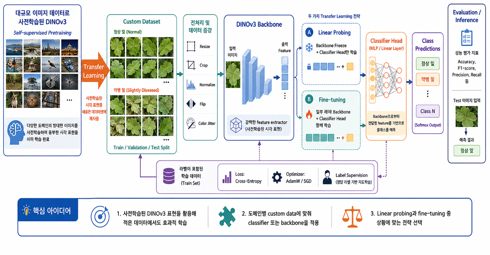
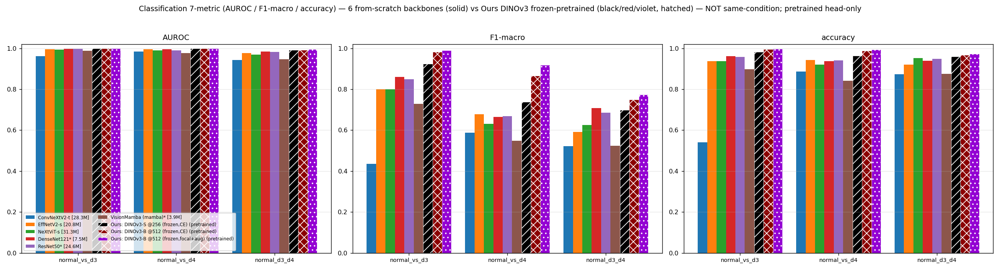
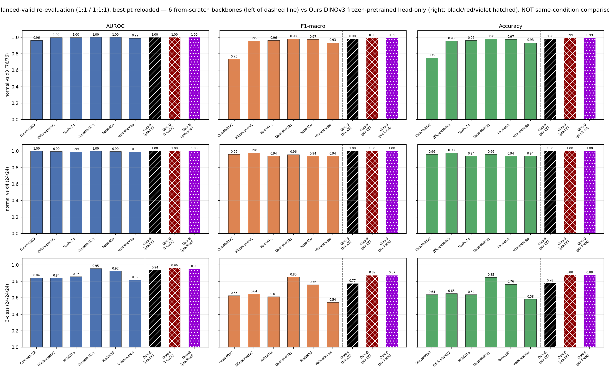
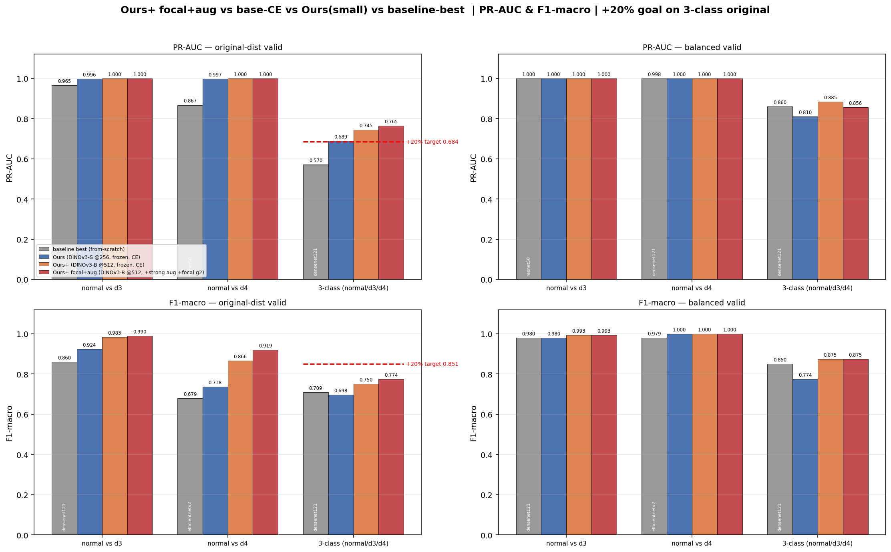
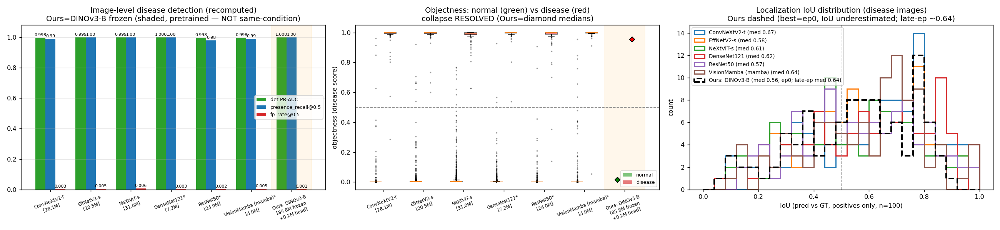
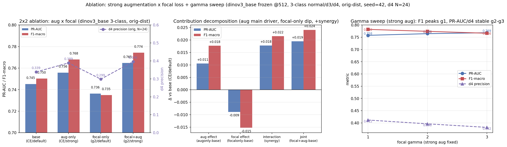
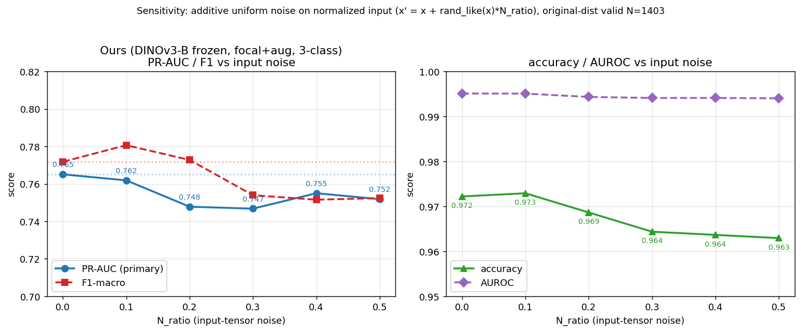
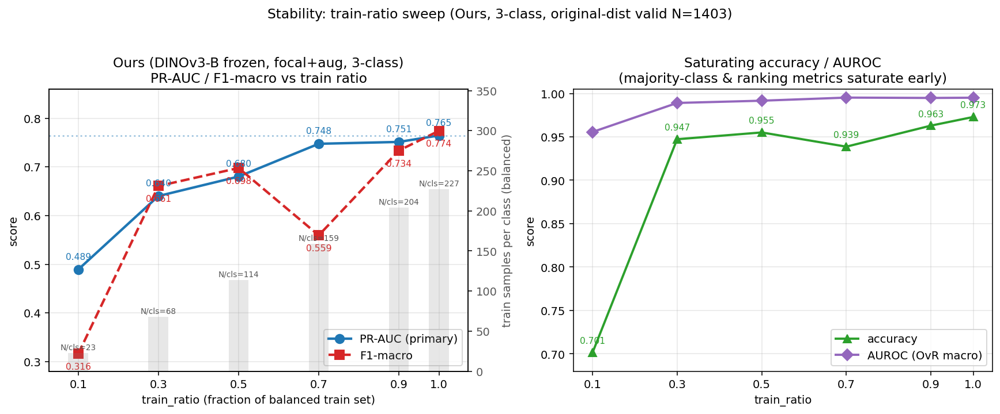
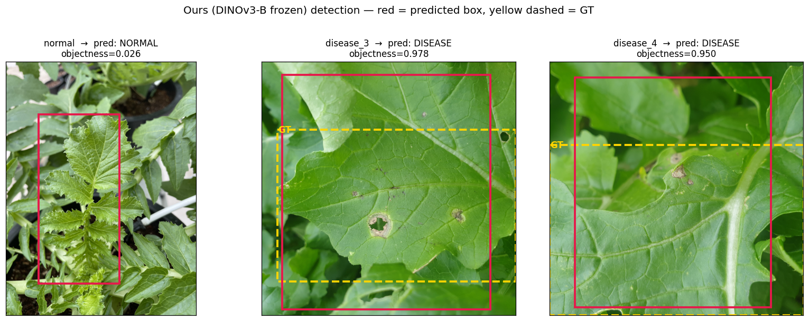
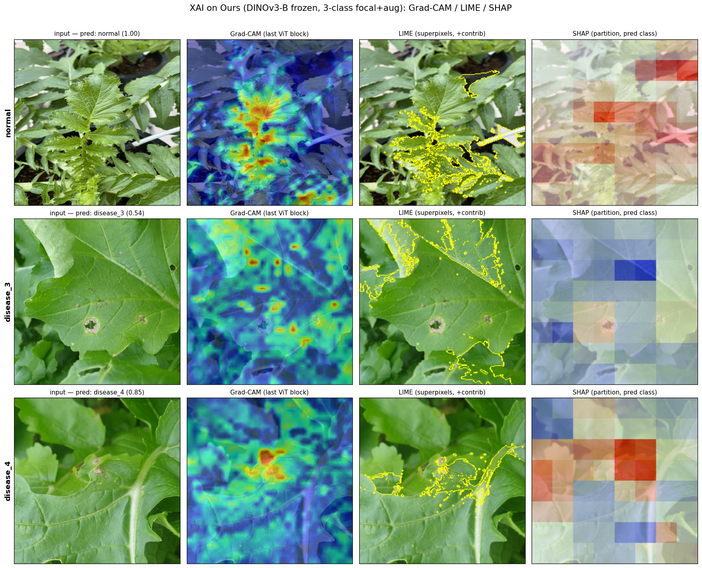

# Frozen DINOv3 Transfer for Imbalanced Radish (무) Crop-Disease Classification and Coarse-Box Detection

*무(radish) 작물 질병 진단 종합 보고서(논문 형식). 그림은 `report/figures/`에 있으며(공개 시 `report/figures/`도 함께 제공), 모든 수치는 동일 split·동일 seed(42)로 학습된 모델의 held-out 예측에서 독립 재계산·교차검증되었다. 소표본(특히 valid disease_4 = 24장)에는 신뢰구간(CI)의 한계를 병기하고 과대해석을 피한다.*

---

## 1. Goal

극심하게 불균형한(정상:질병 ≈ 13–16:1) 실제 무 작물 이미지에서 **(G1) 질병 종류별 분류**(`normal_vs_d3`, `normal_vs_d4`, 3-class `normal/d3/d4`)와 **(G2) 질병 케이스의 객체 검출**(단일 거친 bbox + 이미지 단위 질병 유무)을 동시에 다룬다. 구체적 목표는:

1. **불균형 인지 baseline 확립** — 여러 백본을 동일 split·동일 지표·동일 seed에서 from-scratch로 측정하되, 원분포와 클래스 균형 valid 모두에서 평가해 지표 착시를 제거한다.
2. **사전학습 지식을 보존하면서 소표본에 강한 제안 모델(Ours) 개발** — 가장 어려운 3-class에서 baseline 대비 **PR-AUC +20% 이상**을 목표로 한다.
3. **재현성·견고성 입증** — 입력 노이즈 sensitivity와 학습 데이터량 stability를 정량화하고, 전 과정을 재현 가능하게 한다.

---

## 2. Introduction

**AI 기반 질병 진단.** 딥러닝은 지난 10년간 이미지 기반 질병 진단의 표준 도구가 되었고, 농업(정밀농업, precision agriculture)도 예외가 아니다 [25]. 작물의 잎·열매·뿌리 이미지를 입력으로 질병 유무·종류를 자동 판별하면 전문가 육안 진단의 비용·지연·주관성을 줄이고 조기 방제를 가능케 한다. 농업 현장은 데이터가 풍부하지만 라벨링 비용이 크고 도메인(작물·계절·촬영조건) 변동이 심해, 일반 의료·산업 영상과는 다른 실전 난점을 가진다.

**작물 질병 분류·검출.** 이 분야의 주류는 CNN 기반 **이미지 분류**다. PlantVillage(54,306장, 14작물·26질병)에서 GoogLeNet/AlexNet이 99% 이상의 정확도를 보고했고 [22, 23], 이후 더 깊은 백본과 전이학습으로 확장되었다 [24, 28]. 그러나 이런 결과의 상당수는 **단일 잎을 통제된 배경에서 촬영한 균형 데이터셋**에 기반하며, 실제 노지(in-field) 이미지로 옮기면 성능이 크게 떨어진다 [25, 29]. 나아가 "질병이 있는가"를 넘어 "어디에 있는가"를 답하려면 **검출(detection)** 이 필요하다. 잎 위 병반을 bounding box로 잡는 실시간 검출기가 토마토 등에서 제안되었고 [26], 작물 병해충 검출 전반이 리뷰되었다 [27]. 본 연구는 이 두 과제(분류 + 검출)를 한 데이터에서 함께 다룬다.

**무(radish) 질병 — 본 연구의 범위.** 무(radish)는 국내 주요 노지 작물로, 잎·뿌리 질병의 조기 진단은 수확 손실 저감과 방제 시기 결정에 직결된다. 본 연구는 통제된 PlantVillage류가 아니라 **실제 노지에서 수집된 AI-Hub 무 질병 이미지 데이터셋**(정상/질병 이미지 + 라벨 JSON)을 사용해, (G1) 질병 종류별 분류와 (G2) 질병 영역 검출을 수행한다. 선행 연구의 통제된 설정과 달리 이 실전 데이터의 본질적 난점은 **극심한 클래스 불균형**이다.

| split | normal | disease | 합계 | 불균형(정상:질병) |
|-------|-------:|--------:|-----:|:---------------:|
| train | 11,001 | 697 | 11,698 | 15.8 : 1 |
| valid | 1,303 | 100 | 1,403 | 13.0 : 1 |
| **전체** | **12,304** | **797** | **13,101** | — |

질병은 코드 **disease_3(546장: train 470 / valid 76)** 과 **disease_4(251장: train 227 / valid 24)** 두 종류뿐이며 내부에서도 2.2:1로 불균형하다. 특히 **valid disease_4는 24장**이라 해당 클래스 지표는 통계적으로 매우 불안정하다. 추가 특성:

- **거친 단일 bbox**: 이미지당 박스 정확히 1개이며, 병변 핀포인트가 아니라 잎/작물 영역을 통째로 감싸는 거친 박스다(질병 박스 상대 면적 중앙값 ≈0.50, 정상도 ≈0.45 → 박스 크기로 정상/질병 구분 불가, 중심은 이미지 중앙에 집중).
- **단일 시즌**(2020-10 ~ 2021-01), 촬영 region 메타 전부 결측 → 도메인 다양성이 낮아 외부 일반화 검증에 한계.
- **데이터 품질**: 질병 라벨 43건의 라벨 JSON 기재 `width/height`가 0×0 → 이미지 크기를 실제 파일에서 읽어 bbox를 정규화(전처리에서 처리).

> **함의**: 단순 accuracy는 무의미하고(전부 정상으로 찍어도 ≈93–94%), 불균형 원분포에서 **AUROC도 포화(0.94–1.0)**되어 변별력이 약하다. 평가 주지표는 **PR-AUC·F1-macro·precision**이어야 하며, 학습에는 다운샘플/증강/focal 등 불균형 대응이 필요하다.

---

## 3. Contribution

1. **재현 가능한 실험 파이프라인 + 불균형 인지 baseline**: from-scratch 백본 6종(ConvNeXtV2-tiny / EfficientNetV2-s / NeXtViT-small / DenseNet121 / ResNet50 / Vision-Mamba) × 분류 3세팅 + 단일박스 detection을, **원분포·균형(1:1, 1:1:1) 이중 평가**로 측정(seed=42 고정).
2. **Ours = DINOv3(frozen) + 경량 2-layer head 전이**: 자기지도 사전학습 ViT를 완전 동결(catastrophic forgetting 없음)하고 head(전체의 0.2–0.5%)만 학습. 가장 어려운 3-class 원분포 PR-AUC에서 baseline 최고 대비 **+34.1%**(0.570 → 0.765)로 +20% 목표를 견고히 달성.
3. **Detection objectness collapse 발견·수정**: 초기 detection은 정상을 음성으로 다루지 않아 objectness가 전 이미지에서 ≈1.0으로 붕괴 → 데이터·지표를 수정(정상=음성)해 재학습, 정상/질병 분리(median ≈0.02 vs ≈0.99)를 정량 확인.
4. **강한 증강 × focal loss ablation**: 2×2 + gamma 스윕으로 기여를 정직하게 분해(강한 증강이 주 동력, focal은 증강과 결합 시에만 양의 시너지).
5. **견고성·데이터 효율 분석**: 입력 노이즈 sensitivity(PR-AUC 저하 ≤2.4%)와 train-ratio stability(PR-AUC 단조 증가·90%↑ 포화)로 frozen 전이의 강건성을 정량화.
6. **재현·배포 산출물**: held-out 예측 기반 정합성 교차검증, 단일 실행 노트북, FastAPI·Streamlit 데모(다중 파이프라인 비교 + 음성 STT·VLM 기반 VQA)를 제공.

---

## 4. Related Work

기존 사례를 세 갈래로 조사하고(§4.1 농업 AI, §4.2 AI 기술, §4.3 설명가능 AI), 본 연구와의 차별성을 §4.4에 정리한다.

### 4.1 농업 관련 AI 기술 조사

작물 질병 진단에 대한 AI 적용은 분류와 검출 양쪽에서 활발하다. 분류에서는 Mohanty 등 [22]이 PlantVillage 공개 데이터 [23]에서 CNN으로 99.35% 정확도를 보고하며 흐름을 열었고, Ferentinos [24]는 25작물·58질병으로 규모를 키워 VGG 계열 99.5%를 보였으며, Too 등 [28]은 여러 백본의 fine-tuning을 체계적으로 비교했다. Kamilaris & Prenafeta-Boldú [25]는 농업 전반의 딥러닝 적용을 서베이했다. 검출(국소화)에서는 Fuentes 등 [26]이 토마토 병해충을 bounding box로 잡는 실시간 검출기를, Liu & Wang [27]이 작물 병해충 검출 전반을 리뷰했다. 다만 이들 대부분은 **통제된 단일 잎·균형 데이터·분류 중심**이라는 공통 한계를 가진다.

### 4.2 AI 기술

본 연구가 쓰거나 비교하는 핵심 기술은 다음과 같다. ViT [3]가 이미지 분류에 트랜스포머를 도입한 뒤, 자기지도 학습 DINOv2 [2]와 그 최신판 **DINOv3 [1]** 가 레이블 없이 강한 일반 표현을 학습해 동결 backbone + 경량 head 전이에 적합함이 알려졌다. CNN 계열로는 ConvNeXt V2 [4]·EfficientNetV2 [5], 상태공간 기반으로는 Vision Mamba [10]가 대표적이며, 극단 불균형 대응으로 Focal loss [11]가 널리 쓰인다. (본 연구 baseline은 위에 더해 Next-ViT [6]·DenseNet [7]·ResNet [8]·Mamba [9]까지 6백본을 from-scratch로 비교하고, 검출 박스 회귀에 GIoU [12], 강한 증강에 TrivialAugment [16]·Random Erasing [17]를 사용한다 — §5. 불균형 평가는 PR 곡선이 ROC보다 신뢰되며 [13] 소표본 비율엔 Wilson CI [14]를 병기한다. 구현은 PyTorch [21]·timm [15].)

### 4.3 AI + 설명가능/해석가능 (XAI)

모델 판단 근거를 검증하는 설명가능 AI는 크게 gradient·모델불가지·트랜스포머 전용으로 나뉜다. **Grad-CAM [30]** 은 마지막 합성곱/블록 특징의 gradient로 클래스 saliency를 만들고, **LIME [31]** 은 슈퍼픽셀 perturbation으로 국소 선형 근사를, **SHAP [32]** 는 Shapley 값으로 각 영역의 기여를 추정한다(둘 다 모델 불가지). Integrated Gradients [33]는 경로적분 기반 속성, Attention Rollout [34]과 Chefer 등 [35]은 트랜스포머 전용 해석을 제안한다. 특히 자기지도 ViT의 **emergent self-attention이 객체를 분할**한다는 DINO 관찰 [36]은 본 연구가 DINOv3를 backbone으로 택한 직접적 근거가 된다.

### 4.4 본 연구와의 차별성

- **vs §4.1 (농업 AI):** 통제된 PlantVillage가 아니라 **실제 노지·극단 불균형(13–16:1)의 무 데이터 [20]** 에서 분류와 거친 단일박스 검출을 함께 수행하고, accuracy가 아닌 **PR-AUC를 주지표**로 평가한다(불균형 지표 착시 제거를 위해 원분포·균형 valid 이중 평가). 데이터 규모·다양성이 일반화 병목이라는 지적 [29]을 §6.7 stability로 직접 정량화한다.
- **vs §4.2 (AI 기술):** 백본을 from-scratch/지도 전이로 쓰는 대신 **자기지도 DINOv3를 완전 동결하고 head만 학습(head-only transfer)** 해 사전학습 지식을 보존(no forgetting)하면서 trainable 파라미터를 전체의 0.2–0.5%로 줄이고, focal·strong aug로 소표본 불균형을 공략한다.
- **vs §4.3 (XAI):** XAI를 표준·균형 벤치마크가 아니라 **불균형 노지 전이모델의 검증**에 적용한다 — Grad-CAM(모델 내부) × LIME·SHAP(모델 불가지)를 교차검증하고, 검출 시각화 + VQA(영어 질병특성 QA; Whisper STT [18] + SmolVLM [19])까지 결합해 사람이 읽을 수 있는 설명을 제공한다(§6.8–6.9).

---

## 5. Proposed Method

### 5.0 전체 파이프라인 개요

아래 그림은 제안 방법(Ours)의 **전체 흐름**을 도식화한 것이다.



흐름은 다음과 같다. **(1) 사전학습**: DINOv3가 대규모 이미지에서 self-supervised로 강한 일반 시각 표현을 미리 학습한다(그림 좌). **(2) 전이학습**: 이 표현을 무 질병 custom 데이터(정상 잎 / 질병 잎, train·validation·test split)로 옮긴다 — 입력은 Resize·Crop·Normalize·Flip·ColorJitter로 전처리·증강된다. **(3) DINOv3 backbone**이 입력 이미지를 feature로 변환하고(사전학습된 강력한 feature extractor), 두 가지 전이 전략 — **(A) Linear Probing**: backbone 동결(❄) + classifier head만 학습, **(B) Fine-tuning**: 일부 backbone(🔥) + head 동시 학습 — 중 하나를 택한다. 학습은 라벨이 있는 train set에서 Cross-Entropy(본 연구는 focal로 대체 가능)와 AdamW로 지도학습된다. **(4) Classifier head(2-layer MLP)** 가 softmax로 클래스(정상/disease_k)를 예측하고, **(5) Evaluation/Inference**에서 Accuracy·F1·Precision·Recall(본 연구의 주지표는 PR-AUC) 등으로 평가한다.

**본 연구의 선택.** 단일 시즌·극단 불균형·소표본(특히 valid d4=24)이라는 데이터 특성상 Ours는 두 전략 중 **(A) Linear Probing(backbone 완전 동결 + head-only 학습)** 을 채택한다 — 사전학습 지식을 보존(no forgetting)하고 학습 파라미터를 전체의 0.2–0.5%로 줄여 과적합을 구조적으로 억제하기 위함이다(상세 §5.3). 검출 역시 동일한 frozen backbone에 단일박스+objectness head를 얹는 같은 골격을 따른다(§5.2). 핵심 아이디어는 ① 사전학습 DINOv3 표현으로 적은 데이터에서도 효과적으로 학습하고, ② 도메인 custom 데이터에 맞춰 head/backbone을 적용하며, ③ linear-probing과 fine-tuning 중 상황에 맞는 전략을 선택하는 것이다. 이후 §5.1–5.3은 각 단계(데이터 처리·baseline·Ours)를 구체화한다.

### 5.1 문제 정의·데이터 처리

- **입력**: RGB 무 이미지(해상도·방향 혼재 → 리사이즈·ImageNet 정규화·EXIF 보정, 크기는 실제 파일에서 읽음).
- **분류 출력**: `normal_vs_d3`, `normal_vs_d4`(2-class), `normal_d3_d4`(3-class). **검출 출력**: 질병 단일 bbox(xyxy∈[0,1]) + 이미지 단위 objectness.
- **클래스 균형**: train은 type 간 표본 수를 **다운샘플로 균형**(2-class d4=227×2, 3-class=type당 227). valid는 **원분포**와 **균형 다운샘플**(2-class 1:1, 3-class 1:1:1; seed 고정) 두 방식으로 평가.
- **효율적 파이프라인**: 디코드+리사이즈를 1회만 수행해 RAM에 캐시(워커 fork copy-on-write 공유) → epoch 104s→~1.8s, GPU util 0%→55–87%.

### 5.2 Baseline 구성

백본 6종을 **as-is·from-scratch(pretrained 미로딩)** 로 분류기 래핑: 풀링 특징 → 공통 헤드(`LayerNorm → Linear → GELU → Dropout → Linear`). 검출은 풀링 특징 → 단일 박스 회귀 + objectness 헤드, loss = GIoU(2)+L1(5)+objectness BCE(1)(box loss는 양성만). (MambaVision은 `mamba_ssm` CUDA 빌드 불가로 순수 PyTorch pscan Vision-Mamba로 대체; NeXtViT-base는 본 보고서에서 제외 → 6 백본 / 24 baseline run 기준.)

### 5.3 Ours: 동결 DINOv3 + 경량 head 전이

핵심: 대규모 자기지도 **DINOv3 ViT를 완전 동결**(`requires_grad=False`, no-grad/eval forward)하고 **2-layer MLP head만 학습**한다. 동결이 사전학습 표현을 보존(no forgetting)하고, 학습 파라미터를 head로 제한해 소표본 과적합을 구조적으로 억제한다.

- **Ours(small)**: `vit_small_patch16_dinov3` @256, 풀링 384-d, head `Linear(384,256)→GELU→Dropout→Linear`. total **21.69M / trainable(head) ≈99k(0.46%)**.
- **Ours+(base)**: `vit_base_patch16_dinov3` @512, 풀링 768-d, head hidden 512. total **86.04M / trainable ≈395k**. 해상도·백본 확장으로 미세 병변·d3↔d4 구분 표현력 강화.
- **Ours+ focal+aug**: 위와 동일 구조, 학습만 strong aug + focal(γ=2).
- **Ours detection**: 동일 DINOv3-B frozen + 단일박스+objectness head(trainable 0.200M / 85.84M).

**Algorithm (pseudocode).**
```
Backbone B  ← DINOv3 ViT (S/16@256 또는 B/16@512), self-supervised pretrained
            freeze(B): 모든 파라미터 requires_grad=False, B.eval()
Head H      ← Linear(feat_dim→hidden) → GELU → Dropout → Linear(hidden→C)
optimizer   ← AdamW(params = H.parameters(), lr=1e-3, wd=0.05)        # head만
loss_fn     ← FocalLoss(γ=2, α=class_weights)   또는 CrossEntropy
augment     ← strong(RRC, H/V-flip, rotation, ColorJitter, TrivialAugment, RandomErasing)  # train만

# 학습 (head-probe)
for epoch in 1..E:                       # E=30(S)/40(B), cosine+warmup, train은 클래스 균형
  for (img, y) in train_loader:
    x = normalize(augment(img))
    with no_grad(): feat = B.forward_features(x)     # (B, feat_dim) pooled, 동결
    loss = loss_fn(H(feat), y); loss.backward(); optimizer.step(); zero_grad()   # H만 갱신
  evaluate(valid); keep best by PR-AUC (det: det_pr_auc)            # early-stop

# 추론
pred = softmax( H(B.forward_features(normalize(img))) )

# 검출 변형(동일 동결 백본)
Head_det ← Linear(feat→4)(box∈[0,1]) ⊕ Linear(feat→1)(objectness)
loss_det ← GIoU(2)+L1(5)[양성만] + BCE(1)[objectness; 정상=음성]
```

하이퍼파라미터 전체는 부록 A 참조.

---

## 6. Experiments

**수행한 실험**: baseline 24 run(분류 18 = 6백본×3세팅 + detection 6) + Ours 분류 9 + Ours detection 1 + ablation 4(+참조 2). 전부 seed=42, 동일 valid, 원분포+균형 이중 평가. 추가로 학습 없이 forward-only로 sensitivity(§6.6)·stability(§6.7)·explainability(§6.8 검출 시각화 + VQA, §6.9 XAI: Grad-CAM/LIME/SHAP)를 수행. **정합성 교차검증**(부록 B): 전 run 예측의 표본 수·라벨 분포가 데이터 manifest와 정확히 일치(누수·오집계·split 위반 없음), 재계산이 보고치와 일치(누락 지표는 sklearn로 독립 재계산·교차검증).

### 6.1 분류 — 원분포 valid (주지표 PR-AUC; baseline=from-scratch, Ours=DINOv3 pretrained → 동일 조건 아님)

**3-class `normal/d3/d4` (가장 어려운 세팅; normal 1303 / d3 76 / d4 24)**

| 모델 | accuracy | recall(M) | F1-macro | AUROC | **PR-AUC** |
|------|:---:|:---:|:---:|:---:|:---:|
| ConvNeXtV2 | 0.874 | 0.640 | 0.523 | 0.943 | 0.343 |
| EfficientNetV2 | 0.920 | 0.676 | 0.591 | 0.977 | 0.509 |
| NeXtViT-s | 0.952 | 0.617 | 0.624 | 0.969 | 0.487 |
| DenseNet121 | 0.940 | 0.862 | 0.709 | 0.984 | **0.570** (baseline 최고) |
| ResNet50 | 0.949 | 0.762 | 0.685 | 0.983 | 0.530 |
| VisionMamba | 0.875 | 0.634 | 0.524 | 0.947 | 0.359 |
| **Ours: DINOv3-S@256(CE)** | 0.961 | 0.753 | 0.698 | 0.991 | 0.689 |
| **Ours+: DINOv3-B@512(CE)** | 0.967 | 0.840 | 0.750 | 0.993 | 0.745 |
| **Ours+: focal+aug** | 0.973 | 0.850 | **0.774** | 0.995 | **0.765** |



**2-class**: normal_vs_d3 — baseline 최고 ResNet50 PR-AUC 0.965, Ours+ focal+aug **1.000 / F1 0.990**. normal_vs_d4(소표본) — baseline 최고 ResNet50 0.867, Ours+ focal+aug **1.000 / F1 0.919**.

baseline 우열(PR-AUC): **DenseNet121 ≈ ResNet50 ≳ EfficientNetV2 > NeXtViT-s > VisionMamba > ConvNeXtV2**. AUROC는 6×3 전부 0.94–1.0 포화로 변별 불가.

### 6.2 분류 — 균형 valid (착시 제거)

균형 3-class(N=72)에서 accuracy가 일제히 급락(EfficientNetV2 0.920→0.653)하고 AUROC 포화가 풀려(0.94–0.98 → 0.82–0.95) 분리력이 생긴다 → 원분포의 높은 acc/AUROC는 상당 부분 다수 정상으로 부풀려진 것. 균형 3-class에서 DenseNet121이 baseline 1위(PR-AUC 0.860·F1 0.850), **Ours+(B,CE)는 PR-AUC 0.885·F1 0.875로 baseline 최고를 상회**.



### 6.3 +20% 목표 판정 (정직)

목표 기준 = 3-class 원분포 baseline 최고(PR-AUC 0.570, F1 0.709) 대비 +20% → **PR-AUC ≥ 0.684, F1 ≥ 0.851**.

| 지표(3-class 원분포) | baseline 최고 | Ours(S) | Ours+(B,CE) | **focal+aug** | 상대% | 목표 |
|---|:---:|:---:|:---:|:---:|:---:|:---:|
| **PR-AUC** | 0.570 | 0.689 | 0.745 | **0.765** | **+34.1%** | ≥0.684 → **달성** |
| **F1-macro** | 0.709 | 0.698 | 0.750 | **0.774** | **+9.2%** | ≥0.851 → 미달 |

**PR-AUC(주지표) 목표 견고히 달성**, F1-macro는 단조 개선되나 절대 목표는 d4 소표본 precision 병목으로 미달(§7 Discussion).



### 6.4 Detection

이미지 단위 질병 검출(원분포 양성 100 / 음성 1303): 6 백본 + Ours 전부 **det PR-AUC 0.997–1.000** 포화, objectness 분리 깨끗(질병 median ≈0.955–0.999 vs 정상 ≈0.017). Ours(DINOv3-B frozen) **det PR-AUC 1.000, presence_recall@0.5 1.000, fp_rate@0.5 0.0008**. 국소화는 거친 GT 특성상 **IoU median 0.57–0.67, mAP@0.5 0.46–0.60**으로 상한이 분명. "있는지"는 거의 완벽, "어디인지"는 거친 crop 영역 회귀 수준.



### 6.5 Ablation — aug × focal (3-class 원분포)

| run | loss / aug | PR-AUC | F1-macro | d4 precision |
|---|---|:---:|:---:|:---:|
| base | CE / default | 0.745 | 0.750 | 0.339 |
| augonly | CE / strong | 0.756 | 0.768 | 0.389 |
| focalonly | focal γ2 / default | 0.736 | 0.735 | 0.299 |
| focal+aug | focal γ2 / strong | **0.765** | **0.774** | **0.396** |

요인 분해(PR-AUC): **aug 효과 +0.0105, focal 효과 −0.0088, 상호작용(시너지) +0.0178**. → 강한 증강이 주 동력, focal 단독은 소폭 하락, **조합에서만 양의 시너지**. gamma 스윕(strong 고정): PR-AUC·AUROC는 γ3, F1·d4 precision은 γ1이 최고(γ2 절충) — 단 d4 N=24 CI 내라 추세로만 해석.



### 6.6 Sensitivity — 입력 노이즈 강건성 (Ours, 3-class)

학습된 Ours(focal+aug) best 모델을 재학습 없이 로드, 정규화 입력 텐서에 `x ← x + rand_like(x)·N_ratio`(seed 고정) 적용:

| N_ratio | 0.0 | 0.1 | 0.2 | 0.3 | 0.4 | 0.5 |
|:---:|:---:|:---:|:---:|:---:|:---:|:---:|
| PR-AUC | 0.765 | 0.762 | 0.748 | 0.747 | 0.755 | 0.752 |
| ΔPR-AUC | — | −0.4% | −2.3% | −2.4% | −1.3% | −1.7% |

**매우 강건**(저하 ≤2.4%, AUROC 0.995→0.994 거의 불변) — frozen 백본+head 구조 덕분.



### 6.7 Stability — train ratio sweep (Ours, 3-class)

| train_ratio | 0.1 | 0.3 | 0.5 | 0.7 | 0.9 | 1.0 |
|:---:|:---:|:---:|:---:|:---:|:---:|:---:|
| 표본/클래스 | 23 | 68 | 114 | 159 | 204 | 227 |
| PR-AUC | 0.489 | 0.640 | 0.680 | 0.748 | 0.751 | **0.765** |
| F1-macro | 0.316 | 0.661 | 0.698 | 0.559 | 0.734 | **0.774** |

**PR-AUC는 데이터량에 단조 증가하고 90%↑ 포화**(수확체감). F1-macro는 r0.7에서 출렁(argmax·d4 N=24 민감).



### 6.8 Explainability — detection 시각화 + VQA 질의응답

정량 지표를 넘어 모델 판단을 사람이 검토할 수 있도록, 예시 valid 이미지 3장(정상 1 + 질병 2: disease_3, disease_4; 각 klass 정렬 목록의 중앙 이미지를 결정적으로 선택)에 대해 두 가지 설명가능성 산출물을 만들었다. (1) **검출 시각화**: Ours(DINOv3-B frozen) detection의 예측 박스·objectness를 GT 박스와 겹쳐 그림으로 제시. (2) **VQA**: 동일 이미지에 질병 특성을 묻는 영어 질문을 SmolVLM(VLM)에 던져 자연어 설명을 얻음. 둘 다 학습된 체크포인트를 forward-only로 사용(재학습 없음).

**(1) 검출 시각화.** 정상은 objectness **0.026 → NORMAL**, 질병은 disease_3 **0.978 / disease_4 0.950 → DISEASE**로, 이미지 단위 질병 유무를 깨끗이 분리한다(§6.4의 정량 결과와 일치). 예측 박스(빨강)는 작물 영역을 거칠게 감싸 GT(노랑 점선)와 대체로 겹치되, §7에서 논한 대로 핀포인트 병변이 아니라 거친 crop 영역 수준이다.



**(2) VQA 질의응답(영어).** 같은 이미지에 "이 무 잎이 건강한가/병들었는가", "어떤 질병 증상이 보이는가", "손상 부위의 색·질감 설명", "가장 손상이 심한 부위" 등을 질문한 응답(SmolVLM):

| 이미지(klass) | Question | VQA Answer (SmolVLM) |
|---|---|---|
| **normal** | Is this radish leaf healthy or diseased? | "The leaf is healthy." |
| normal | What disease symptoms are visible on this radish plant? | "There are no radish plants present in the image, only a plant with a leaf." (증상 없음) |
| **disease_3** (천공/구멍, risk 1) | Is this radish leaf healthy or diseased? | "The leaf has holes, which might indicate it is diseased." |
| disease_3 | What disease symptoms are visible on this radish plant? | "There are holes on the green leaves of the radish plant." |
| disease_3 | Describe the color and texture of any affected or damaged areas. | "…a large, irregularly shaped hole… The surrounding area around the hole is slightly darker, possibly indicating a small area of discoloration…" |
| **disease_4** (갈색 반점, risk 1) | Is this radish leaf healthy or diseased? | "The leaf appears to be healthy." *(부정확 — 아래 한계 참조)* |
| disease_4 | What disease symptoms are visible on this radish plant? | "There are brown spots on the radish plant." |
| disease_4 | Describe the color and texture of any affected or damaged areas. | "…the texture of the affected areas is rough and uneven." |

**해석·한계.** 검출 시각화는 모델의 판단 근거(질병 유무 + 대략적 위치)를 직관적으로 보여 준다. VQA는 학습된 진단기가 아니라 **범용 VLM(zero-shot)** 으로, disease_3의 "구멍/천공"과 disease_4의 "갈색 반점"이라는 **질병 특성을 영어로 정확히 기술**하는 등 보조 설명으로 유용했다. 다만 disease_4의 유무 판정에서 "appears to be healthy"처럼 **일관되지 않은 응답**도 나왔다(질문에 따라 갈림). 따라서 **질병 판정·국소화는 정량 검출/분류 파이프라인(§6.1–6.4)이 담당하고, VQA는 사람이 읽을 수 있는 보조 설명**으로 한정해 사용해야 한다.


### 6.9 XAI — Grad-CAM / LIME / SHAP: DINO가 이미지를 제대로 보는가

설명가능성을 한층 더 검증하기 위해, Ours+(DINOv3-B frozen, 3-class focal+aug `dinov3_base_focal_normal_d3_d4`)의 예측이 **올바른 영역(무 잎·병변)** 에 근거하는지를 **모델-내부(Grad-CAM)** 와 **모델-불가지(LIME, SHAP)** 관점에서 교차검증했다. 앞과 동일한 예시 3장에 forward-only로 적용(재학습 없음):

- **Grad-CAM** [30]: 마지막 ViT 블록(`blocks[-1].norm1`) 토큰을 32×32 패치 그리드로 reshape한 class saliency. frozen 백본이라 **입력 텐서에 `requires_grad`를 켜 backbone activation으로 gradient를 흘렸다**(파라미터는 동결 유지).
- **LIME** [31]: 224 해상도에서 슈퍼픽셀 1,000회 perturbation → 예측 클래스에 양으로 기여하는 영역(노란 경계).
- **SHAP** [32]: 160 해상도 Partition(blur) masker로 예측 클래스 Shapley 기여(red=+, blue=−).

예측 확률은 normal **0.9999**, disease_3 **0.540**(d4 0.460), disease_4 **0.850** 으로 셋 다 정답 클래스다.



**결과(정성 요약).** 세 예시 모두 예측 클래스가 정답이며, 세 설명기법의 근거가 **무 잎/병변 영역에 수렴**한다(배경 기여 거의 없음).

| 예시(GT) | 예측 (확률) | Grad-CAM (모델 내부) | LIME (superpixel, +기여) | SHAP (partition, +기여) | 교차 일치 |
|---|---|---|---|---|---|
| normal | **normal** (1.000) | 잎 전반에 분산된 saliency | 잎 슈퍼픽셀에 +기여 | 잎 영역 +기여 | 잎/식물체에 일치 |
| disease_3 | **disease_3** (0.540; d4 0.460) | 잎의 병반(구멍) 주변 **국소 핫스팟** | 손상된 잎 영역 경계 | 병반 인접 영역 +기여 | 병변 영역에 일치 |
| disease_4 | **disease_4** (0.850) | 중앙 잎 영역에 집중 | 잎 중심부 슈퍼픽셀 | 잎 중심부 +기여 | 잎 중심부에 일치 |

확률은 `_workspace/eval/xai_dinov3.json`의 softmax 값이며, 공간 근거 기술은 위 그림의 정성 판독이다.

**해석.** 세 기법이 일관되게 **배경이 아니라 무 잎/작물 영역**을 근거로 지목한다 → DINOv3 표현이 대상에 정렬되어 있고, 분류기가 올바른 픽셀을 보고 판단함을 시사. disease_3에서는 Grad-CAM 핫스팟이 잎의 병반(구멍) 주변에 국소화되고 LIME·SHAP도 손상 잎 영역을 양의 기여로 잡는다. disease_3 확률(0.54)이 disease_4(0.46)와 접전인 점은 §7의 d3↔d4 혼동·d4 소표본 병목과 일치한다. **한계**: 계산량을 줄이려 perturbation 해상도를 낮췄고(LIME 224 / SHAP 160), Grad-CAM은 ViT 마지막 블록 기준이라 더 얕은 층의 근거는 보지 않는다 — 정성적 검증용 보조 지표다.

---

## 7. Discussion

- **불균형 지표 해석**: 원분포에서 accuracy·AUROC는 포화되어 백본을 거의 구분하지 못한다. 우열은 PR-AUC·F1-macro·precision으로 갈리며(0.34–0.97), 균형 valid 평가가 이 착시를 정량적으로 드러낸다.
- **공정성 한계**: baseline은 from-scratch, Ours는 DINOv3 자기지도 pretrained frozen + head-only다. **동일 조건 비교가 아니며**, Ours 우위의 상당 부분은 대규모 사전학습에서 온다(표·그림에 일관 병기).
- **성능 동력 분해**: 전이(사전학습) ≫ 강한 증강 > focal(단독 음수, 조합 시 양수). small@256→base@512에서 PR +0.056·F1 +0.052 추가.
- **d4 소표본 병목**: valid d4=24장. base-CE confusion `[[1286,1,16],[1,50,25],[0,3,21]]`에서 d4 recall 0.875는 양호하나 **d4 precision 0.339**가 macro-F1을 0.750에 묶는다. focal+aug가 정상→d4 오분류를 16→9장으로 줄여 precision 0.339→0.396로 완화했으나 CI가 넓어 **F1 병목은 완화될 뿐 해소되지 않는다** — PR-AUC로는 목표 초과, argmax-F1으로는 미달인 직접 원인.
- **거친 bbox·objectness 의미**: GT가 작물 영역 통째라 검출은 미세 병변 핀포인트가 아니다. 검출(있는지)은 강하고(det PR-AUC 포화) 국소화(어디인지)는 상한(IoU 0.57–0.67). detection best-epoch이 det_pr_auc 포화로 초기 epoch에 잡혀 저장 IoU가 과소(후반 ≈0.64)인 점도 명시.
- **견고성·데이터 효율**: 입력 노이즈에 강건(≤2.4%), PR-AUC가 데이터량에 단조 증가·90%↑ 포화. 다만 F1 안정성은 다시 d4 절대 표본 수에 제약.
- **설명가능성**: 검출 시각화는 질병 유무(objectness)와 대략 위치를 직관적으로 제시해 사람 검토를 돕는다(§6.8). 범용 VLM(VQA)은 d3 "구멍", d4 "갈색 반점" 같은 특성을 영어로 정확히 기술하나 zero-shot이라 유무 판정이 불안정 — 진단·국소화는 정량 파이프라인이, VQA는 보조 설명만 담당해야 한다. Grad-CAM/LIME/SHAP(§6.9)은 세 기법 모두 예측 근거가 배경이 아닌 무 잎·병변에 모임을 보여, DINOv3 표현이 대상에 정렬되어 있음을 교차검증한다.
- **한계·향후 과제**: (1) baseline pretrained 병행으로 공정 비교, (2) 부분 unfreeze 저-LR 도메인 적응, (3) d4 데이터 확충/오버샘플·미세 병변 라벨로 F1·국소화·안정성 개선, (4) 다시즌 외부 일반화 검증.

---

## 8. Conclusion

**동결 DINOv3 + 경량 2-layer head 전이**는 from-scratch baseline 대비 가장 어려운 3-class 원분포에서 **PR-AUC 0.570 → 0.765(+34%)** 로 주지표 목표(+20%)를 견고히 달성했고, 사전학습 표현을 동결로 보존(no forgetting)하며 전체의 0.2–0.5% 파라미터(head)만 학습해 효율적·재현적이다. **검출(질병 유무)** 은 baseline·Ours 모두 사실상 포화(det PR-AUC 0.997–1.000)했으나 **국소화는 거친 GT 특성상 상한**(IoU 0.57–0.67)이다. 개선의 정직한 귀속은 **전이 ≫ 강한 증강 > focal(조합 시너지)** 이며, **3-class F1 절대 목표(0.851)는 d4 valid 24장 precision 병목으로 미달**로 이는 데이터 한계지 방법 한계가 아니다. Ours는 입력 노이즈에 강건하고 데이터량에 안정적으로 스케일한다. **실용 권고**: 질병 유무 스크리닝에는 DINOv3 frozen + head 전이를 우선 권장하고, 3-class 세분화·정밀 국소화는 d4 데이터 확충·미세 병변 라벨 보강(필요 시 분류 + CAM, 부분 unfreeze)이 선행되어야 한다.

---

## 9. Reference

[1] Siméoni et al. (Meta AI). *DINOv3.* arXiv, 2025.
[2] Oquab et al. *DINOv2: Learning Robust Visual Features without Supervision.* TMLR, 2024.
[3] Dosovitskiy et al. *An Image is Worth 16×16 Words: Transformers for Image Recognition at Scale (ViT).* ICLR, 2021.
[4] Woo et al. *ConvNeXt V2: Co-designing and Scaling ConvNets with Masked Autoencoders.* CVPR, 2023.
[5] Tan & Le. *EfficientNetV2: Smaller Models and Faster Training.* ICML, 2021.
[6] Li et al. *Next-ViT: Next Generation Vision Transformer for Efficient Deployment in Realistic Industrial Scenarios.* arXiv:2207.05501, 2022.
[7] Huang et al. *Densely Connected Convolutional Networks (DenseNet).* CVPR, 2017.
[8] He et al. *Deep Residual Learning for Image Recognition (ResNet).* CVPR, 2016.
[9] Gu & Dao. *Mamba: Linear-Time Sequence Modeling with Selective State Spaces.* arXiv:2312.00752, 2023.
[10] Zhu et al. *Vision Mamba: Efficient Visual Representation Learning with Bidirectional State Space Model.* ICML, 2024.
[11] Lin et al. *Focal Loss for Dense Object Detection (RetinaNet).* ICCV, 2017.
[12] Rezatofighi et al. *Generalized Intersection over Union: A Metric and a Loss for Bounding Box Regression.* CVPR, 2019.
[13] Davis & Goadrich. *The Relationship Between Precision-Recall and ROC Curves.* ICML, 2006.
[14] Wilson. *Probable Inference, the Law of Succession, and Statistical Inference.* JASA, 1927.
[15] Wightman. *PyTorch Image Models (timm).* GitHub, 2019.
[16] Müller & Hutter. *TrivialAugment: Tuning-free Yet State-of-the-Art Data Augmentation.* ICCV, 2021. (cf. Cubuk et al. *RandAugment*, NeurIPS 2020.)
[17] Zhong et al. *Random Erasing Data Augmentation.* AAAI, 2020.
[18] Radford et al. *Robust Speech Recognition via Large-Scale Weak Supervision (Whisper).* ICML, 2023.
[19] Marafioti et al. (Hugging Face). *SmolVLM: Redefining Small and Efficient Multimodal Models.* arXiv, 2025.
[20] AI-Hub. *노지작물 질병 진단 이미지 (무/radish).* 한국지능정보사회진흥원(NIA).
[21] Paszke et al. *PyTorch: An Imperative Style, High-Performance Deep Learning Library.* NeurIPS, 2019.

*— 농업/작물 질병 AI —*
[22] Mohanty, Hughes & Salathé. *Using Deep Learning for Image-Based Plant Disease Detection.* Frontiers in Plant Science, 7:1419, 2016.
[23] Hughes & Salathé. *An Open Access Repository of Images on Plant Health to Enable the Development of Mobile Disease Diagnostics (PlantVillage).* arXiv:1511.08060, 2015.
[24] Ferentinos. *Deep Learning Models for Plant Disease Detection and Diagnosis.* Computers and Electronics in Agriculture, 145:311–318, 2018.
[25] Kamilaris & Prenafeta-Boldú. *Deep Learning in Agriculture: A Survey.* Computers and Electronics in Agriculture, 147:70–90, 2018.
[26] Fuentes, Yoon, Kim & Park. *A Robust Deep-Learning-Based Detector for Real-Time Tomato Plant Diseases and Pests Recognition.* Sensors, 17(9):2022, 2017.
[27] Liu & Wang. *Plant Diseases and Pests Detection Based on Deep Learning: A Review.* Plant Methods, 17:22, 2021.
[28] Too, Yujian, Njuki & Yingchun. *A Comparative Study of Fine-Tuning Deep Learning Models for Plant Disease Identification.* Computers and Electronics in Agriculture, 161:272–279, 2019.
[29] Barbedo. *Impact of Dataset Size and Variety on the Effectiveness of Deep Learning and Transfer Learning for Plant Disease Classification.* Computers and Electronics in Agriculture, 153:46–53, 2018.

*— 설명가능 AI (XAI) —*
[30] Selvaraju et al. *Grad-CAM: Visual Explanations from Deep Networks via Gradient-Based Localization.* ICCV, 2017.
[31] Ribeiro, Singh & Guestrin. *"Why Should I Trust You?": Explaining the Predictions of Any Classifier (LIME).* KDD, 2016.
[32] Lundberg & Lee. *A Unified Approach to Interpreting Model Predictions (SHAP).* NeurIPS, 2017.
[33] Sundararajan, Taly & Yan. *Axiomatic Attribution for Deep Networks (Integrated Gradients).* ICML, 2017.
[34] Abnar & Zuidema. *Quantifying Attention Flow in Transformers (Attention Rollout).* ACL, 2020.
[35] Chefer, Gur & Wolf. *Transformer Interpretability Beyond Attention Visualization.* CVPR, 2021.
[36] Caron et al. *Emerging Properties in Self-Supervised Vision Transformers (DINO).* ICCV, 2021.

---

## Appendix A. Hyperparameters

공통: AdamW, weight decay 0.05, cosine LR + warmup, seed 42, label smoothing 0.0, ImageNet 정규화. train은 클래스 균형 다운샘플, valid는 원분포·균형 이중 평가.

| 그룹 | backbone | init | img | batch | lr | epochs | warmup | aug | loss |
|------|----------|------|----:|------:|----|-------:|-------:|-----|------|
| baseline 분류 | 6종 | from-scratch | 224 | 64 | 3e-4 | 60 | 3 | default | CE |
| baseline 검출 | 6종 | from-scratch | 512 | 8 | 3e-4 | 60 | 3 | default | GIoU+L1+BCE |
| Ours (small) | DINOv3 ViT-S/16 | pretrained, **frozen** | 256 | 64 | 1e-3 (head) | 30 | 3 | default | CE |
| Ours+ (base) | DINOv3 ViT-B/16 | pretrained, **frozen** | 512 | 64 | 1e-3 (head) | 40 | 3 | default | CE |
| Ours+ focal+aug | DINOv3 ViT-B/16 | pretrained, **frozen** | 512 | 64 | 1e-3 (head) | 40 | 3 | **strong** | **focal γ2** |
| Ours 검출 | DINOv3 ViT-B/16 | pretrained, **frozen** | 512 | 8 | 1e-3 (head) | 40 | 3 | default | GIoU+L1+BCE |

- strong aug = RandomResizedCrop + H/V flip + rotation + ColorJitter + TrivialAugment + RandomErasing.
- focal loss: γ=2, α=클래스 가중치(균형 후 ≈1.0이라 γ가 실질 기제).
- ablation: 위 Ours+ 구성에서 (aug∈{default,strong}) × (loss∈{CE, focal γ2}) 2×2 + γ∈{1,2,3} 스윕.
- 수치 안정성: NeXtViT·VisionMamba 검출은 fp16에서 NaN → fp32 학습.

## Appendix B. Reproducibility & Consistency

- **이중 평가**: 모든 분류·검출 run을 원분포 valid와 클래스 균형 valid(2-class 1:1 / 3-class 1:1:1; seed 고정 다운샘플)에서 평가해 불균형 지표 착시를 분리.
- **정합성 교차검증**: 각 run의 held-out 예측 파일에서 표본 수·클래스 분포가 데이터 manifest와 정확히 일치함을 확인(누수·중복·split 위반 없음). 보고된 지표(PR-AUC/F1/recall/precision/AUROC/accuracy, detection mAP/IoU/presence/fp)를 scikit-learn으로 독립 재계산해 보고치와 대조.
- **고정 시드·동일 split**: 전 실험 seed=42, 동일 train/valid split. baseline은 from-scratch, Ours는 사전학습 backbone 동결 — 비교 시 이 조건 차이를 명시.
- **재현 절차**: 데이터 준비 → 학습 → 평가 → 데모를 코드 저장소의 재현 가이드 및 단일 실행 노트북으로 제공(체크포인트·대용량 데이터는 별도 배포).
