# 무(Radish) 질병 이미지 데이터셋 분석 보고서

분석 대상: `data/{train,valid}/[원천·라벨]무_{0.정상,1.질병}` — 정상/질병 무 작물 이미지와 라벨(JSON).
산출물: 메타데이터 표 `report/metadata.csv`, 통계 `report/stats.json`, 그림 `report/figures/*.png`.
재현: `./.venv/bin/python data/analyze.py`

이 프로젝트의 목표는 **(1) 질병 종류별 binary classification** 과 **(2) abnormal(질병) 케이스 object detection** 이며,
아래 분석은 각 task 설계에 직접 영향을 주는 사실들을 중심으로 정리했다.

---

## 1. 데이터셋 개요

| split | normal | disease | 합계 | 불균형(정상:질병) |
|-------|-------:|--------:|-----:|:---------------:|
| train | 11,001 | 697 | 11,698 | **15.8 : 1** |
| valid | 1,303 | 100 | 1,403 | **13.0 : 1** |
| **전체** | **12,304** | **797** | **13,101** | — |

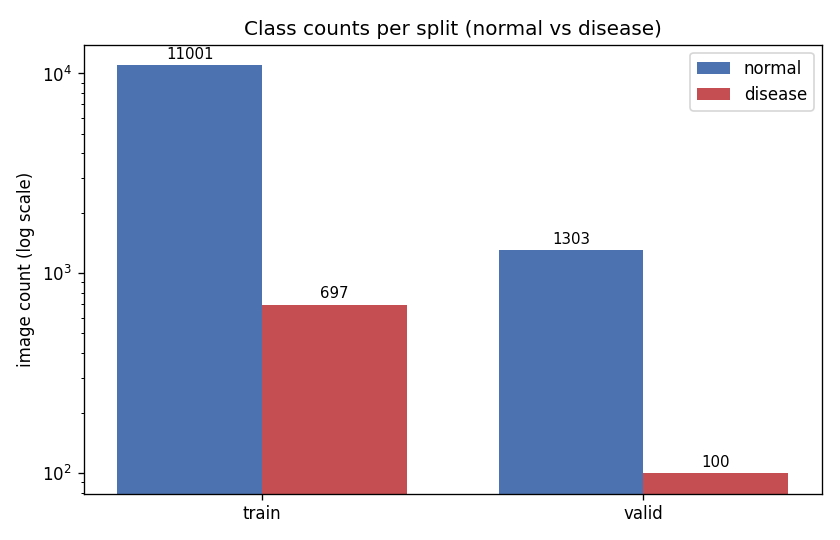

- 라벨 JSON ↔ 원천 이미지는 **1:1 완전 매칭**(고아 0개, `data/verify_pairs.py`로 검증됨).
- 모든 박스 수집 결과 **이미지당 bounding box는 정확히 1개**(`max boxes = 1`, multi-box = 0) → 단일 객체 탐지 문제.
- 촬영 기간은 **2020-10-06 ~ 2021-01-14** 의 단일 시즌(가을~겨울)이며, 질병 이미지의 생육단계(`grow`)는 거의 전부 `12`, `region`은 전부 `null`이다 → 시즌/지역 다양성이 낮음.

> **함의:** 정상 대 질병이 ~13–16:1 로 심하게 불균형하다. 단순 accuracy는 무의미하며(전부 정상이라 찍어도 ~94%), 학습 시 class weight / focal loss / 오버샘플링 + 증강, 평가 시 **PR-AUC·F1·질병 recall** 을 기준으로 삼아야 한다.

---

## 2. 질병 종류 분포

질병은 코드 **3** 과 **4** 두 종류뿐이다(파일명에도 `_1_03_`, `_1_04_` 로 인코딩됨).

| disease code | train | valid | 합계 |
|:-----------:|------:|------:|-----:|
| disease_3 | 470 | 76 | **546** |
| disease_4 | 227 | 24 | **251** |

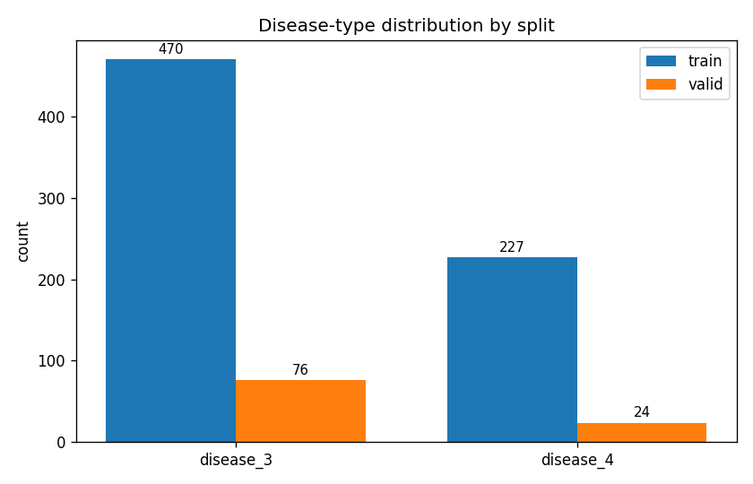

- disease_3 이 disease_4 보다 약 **2.2배** 많다. 질병 내부에서도 불균형이 존재한다.
- valid의 disease_4 는 **24장**뿐 → 이 클래스의 검증 지표는 통계적으로 매우 불안정하다.

> **함의 (task 1):** "질병 종류별 binary classification" 은 자연스럽게 **정상 vs disease_3**, **정상 vs disease_4** 두 모델(또는 normal/d3/d4 3-class)로 구성된다. 데이터가 이미 `data/by_disease/<split>/disease_{3,4}/` 로 분리되어 있어 그대로 활용 가능하다.

---

## 3. 중증도(risk) 분포

`risk` 는 0(없음)/1/2/3(심함)의 심각도 코드다(질병 이미지는 1 이상).

| | risk 1 | risk 2 | risk 3 | 합계 |
|--|------:|------:|------:|-----:|
| disease_3 | 447 | 73 | 26 | 546 |
| disease_4 | 201 | 49 | 1 | 251 |
| **합계** | **648** | **122** | **27** | 797 |

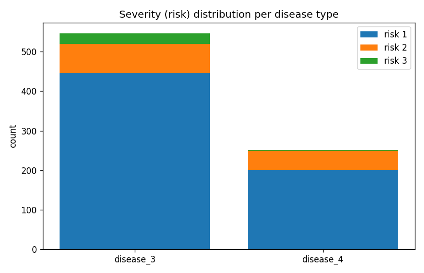

- 전체의 **81%(648/797)** 가 risk 1(경증)에 몰려 있고, risk 3(중증)은 **27장**, 그중 disease_4 는 **단 1장**이다.
- 즉 중증 사례가 극히 희소하다.

> **함의:** 중증도 예측/세분화를 한다면 risk 3, 특히 disease_4·risk3 은 사실상 학습·평가가 불가능하다. 우선은 종류별 이진 분류에 집중하고, 중증도는 보조 라벨 정도로 다루는 것이 현실적이다.

---

## 4. 이미지 속성 (해상도·포맷)

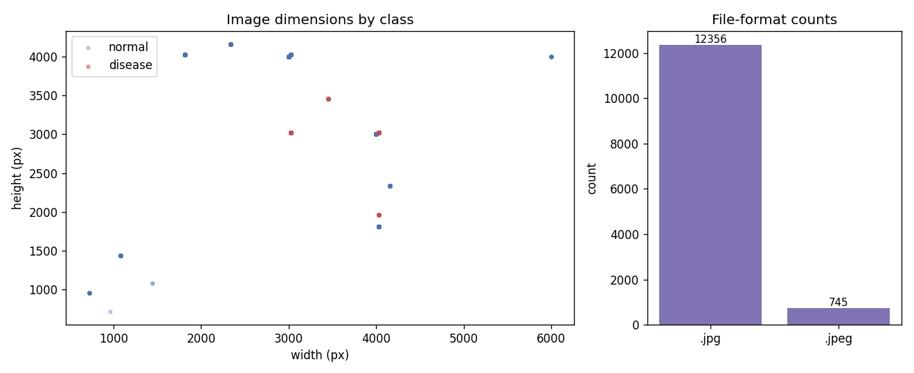

- 해상도는 소수의 **카메라 프리셋 클러스터**(예: 4032×3024, 3024×4032, 3000×4000, 6000×4000, 720×960 등)로 흩어져 있으며 **세로/가로 방향이 혼재**한다. 중앙값은 정상 ~3000×4032, 질병 ~4032×3024.
- 파일 포맷: `.jpg` 12,356 / `.jpeg` 745 (확장자는 대소문자 혼재 — 매칭 시 case-insensitive 필요).

> **함의:** 입력 전처리에서 **리사이즈·종횡비 정규화·EXIF 회전 보정**이 필수다. 정상 이미지 일부는 720×960 처럼 저해상도라 일괄 리사이즈 시 화질 편차에 유의.

---

## 5. 데이터 품질 이슈 ⚠️

분석 중 발견: **질병 라벨 43개의 JSON `description.width/height` 가 0×0** 으로 기록되어 있다.

- 본 분석에서는 해당 이미지를 직접 열어 실제 해상도로 보정했다(`labels_with_zero_dims_in_json: 43`).
- JSON의 width/height 를 그대로 신뢰하는 파이프라인은 이 43건에서 **0 나눗셈 / bbox 정규화 오류**를 일으킨다.

> **권고:** 이미지 크기는 JSON이 아니라 **실제 이미지 파일에서 읽어** 사용하고, bbox 좌표를 실제 해상도 기준으로 정규화할 것.

---

## 6. Bounding Box 분석 (object detection)

### 6.1 박스 상대 면적

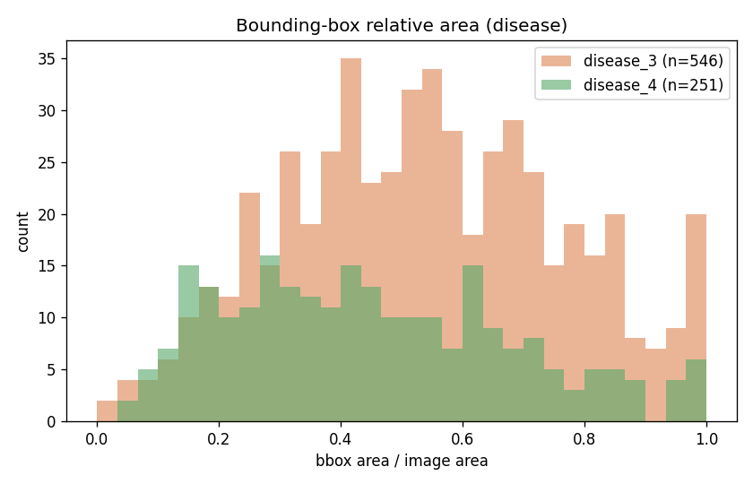

| 클래스 | median | mean | min | max |
|--------|------:|-----:|----:|----:|
| disease | 0.504 | 0.510 | 0.032 | 1.000 |
| normal | 0.453 | 0.439 | 0.000 | 1.000 |

- 질병 박스는 이미지 면적의 **중앙값 ~50%** 를 차지하며 0.03~1.0 까지 넓게 퍼져 있다.
- **정상 이미지에도 박스가 존재**하며(무 전체 영역, 중앙값 ~45%) 박스 크기 분포가 질병과 크게 다르지 않다.

### 6.2 박스 종횡비 / 위치

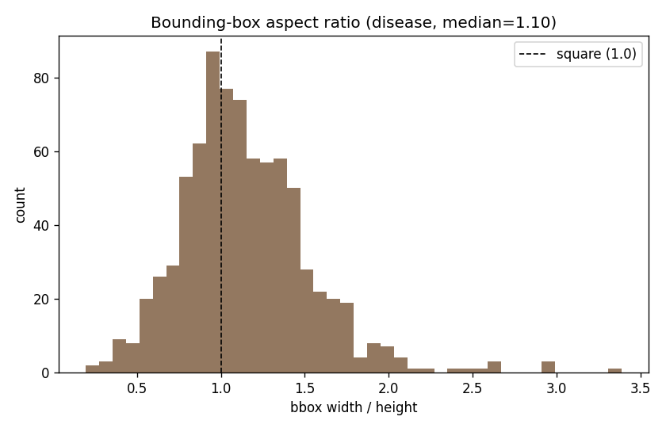
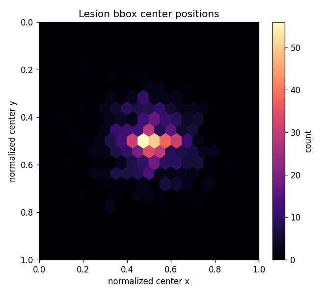

- 박스 중심은 **이미지 중앙(≈0.5, 0.5)** 에 강하게 집중된다(촬영 시 대상 중앙 배치).

> **함의 (task 2):** 박스가 **"병변 핀포인트"가 아니라 "잎/작물 영역" 수준의 거친 단일 박스**(프레임의 절반, 중앙)임을 분명히 인지해야 한다. 따라서
> - 탐지기는 미세 병변이 아니라 "작물 위치"를 학습하게 되며, 정상에도 유사 크기 박스가 있어 **박스 존재 자체로는 정상/질병이 구분되지 않는다**.
> - 질병 박스는 797개로 적다 → 강한 증강과 사전학습 백본 필요.
> - 평가 시 IoU 기반 mAP가 거친 박스 특성상 관대하게 나올 수 있으니, **분류 성능(존재 여부)** 과 **국소화 품질**을 분리해 해석할 것. 미세 병변 국소화가 목표라면 현 라벨로는 한계가 있어 분류 + CAM/Grad-CAM 보조가 더 현실적일 수 있다.

---

## 7. 시간적 분포

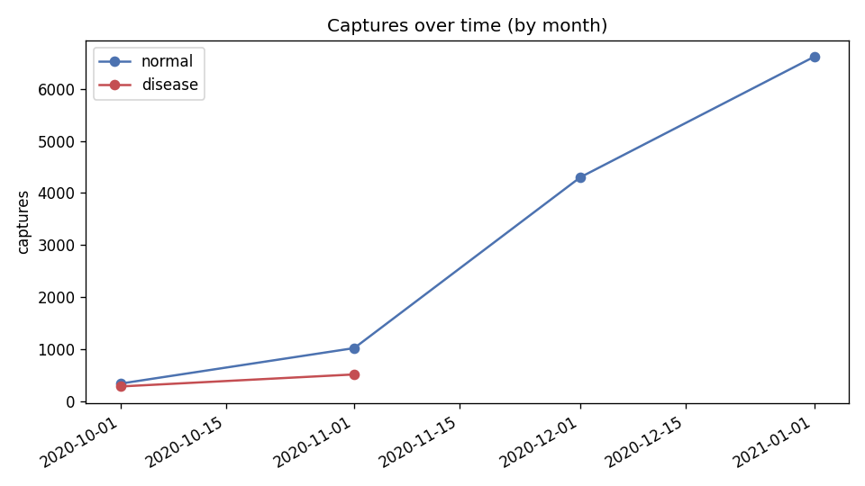

- 2020-10 ~ 2021-01 의 짧은 구간에 집중. 계절/조명 다양성이 제한적이라 **도메인 일반화** 측면에서 주의가 필요하다.

---

## 8. 샘플 이미지

정상 샘플:

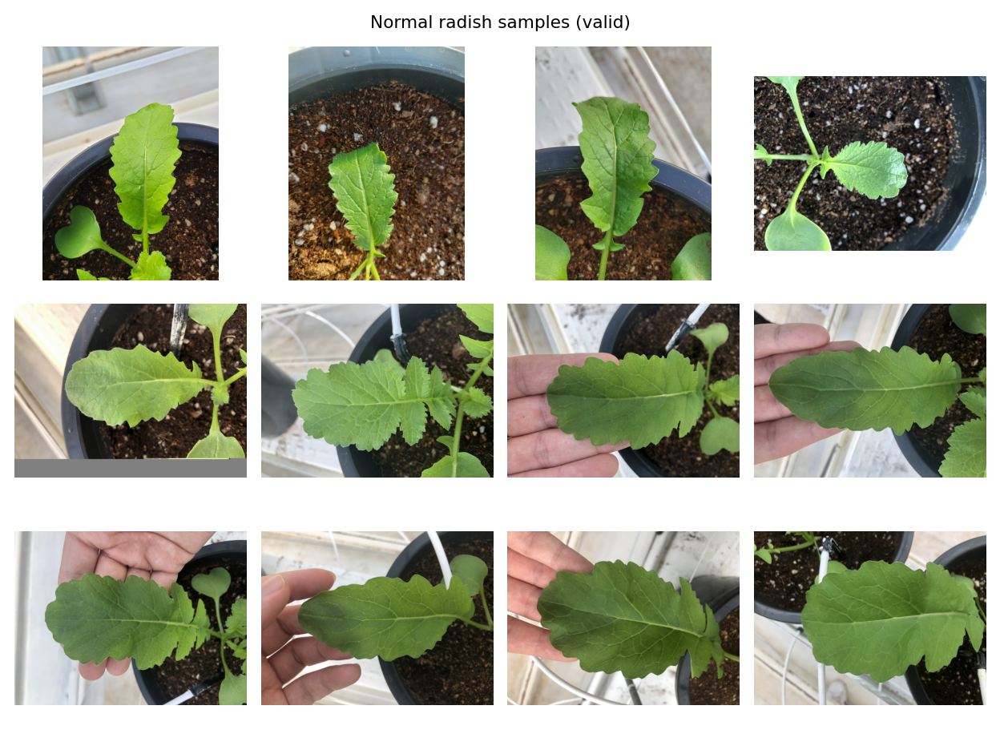

질병 + bbox 샘플 (disease_3 / disease_4):

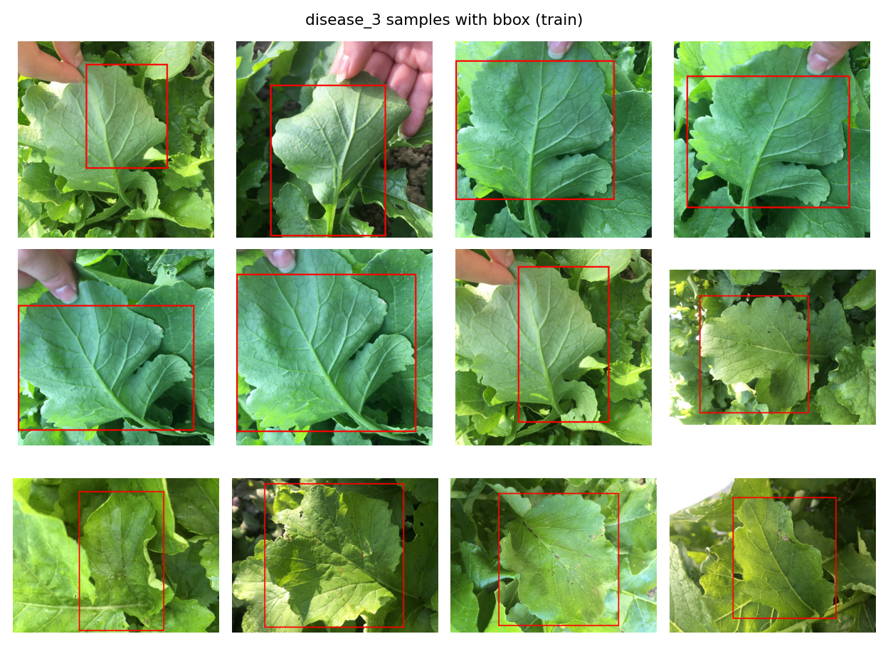
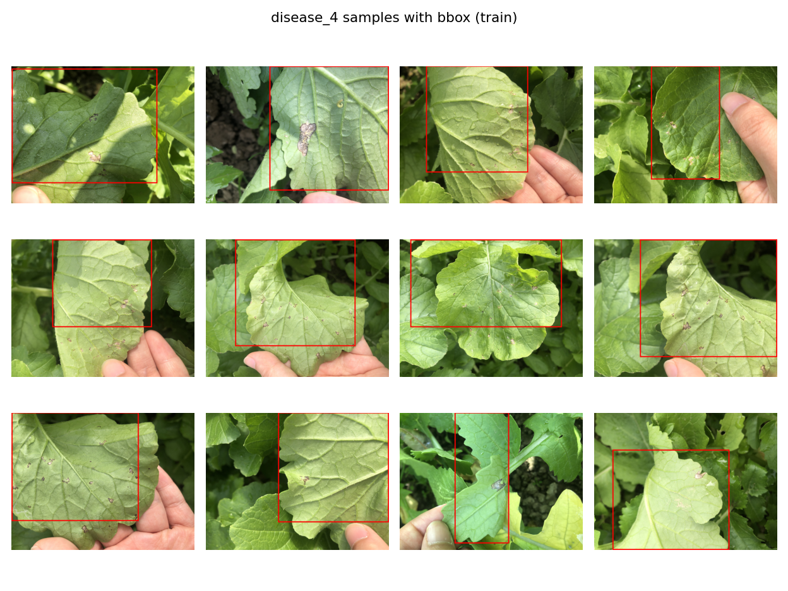

- bbox가 잎/작물 영역을 통째로 감싸는 거친 박스임을 시각적으로 확인할 수 있다.
- (질병 종류별 bbox 시각화 전체는 `data/by_disease/<split>/disease_*/image_w_bbox/` 에도 저장되어 있다.)

---

## 9. 모델링을 위한 핵심 시사점 요약

1. **클래스 불균형(13–16:1)** — class weight/focal loss/오버샘플링, accuracy 대신 PR-AUC·F1·질병 recall.
2. **질병 2종(3·4), 내부 불균형 2.2:1**, valid disease_4 가 24장뿐 — 해당 지표는 신뢰구간을 넓게 볼 것.
3. **중증도(risk) 극단 불균형** — 중증(특히 d4·risk3)은 학습/평가 불가 수준, 보조 라벨로만.
4. **해상도·방향 혼재 + 일부 저해상도** — 리사이즈/정규화/EXIF 보정 필수.
5. **데이터 품질**: JSON 차원 0×0 라벨 43건 — 크기는 실제 이미지에서 읽을 것.
6. **거친 단일 박스(중앙·≈프레임 절반), 정상에도 박스 존재** — 탐지는 병변이 아닌 작물 영역 학습에 가까움; 분류 task의 보완재로 위치 설정 권장.
7. **단일 시즌 데이터** — 외부 일반화 검증 시 한계 인지.

| 산출물 | 경로 |
|--------|------|
| 메타데이터 표 | `report/metadata.csv` |
| 요약 통계 | `report/stats.json` |
| 그림 | `report/figures/01–11_*.png` |
| 종류별 분리 데이터 | `data/by_disease/<split>/disease_{3,4}/{images,labels,image_w_bbox}/` |
